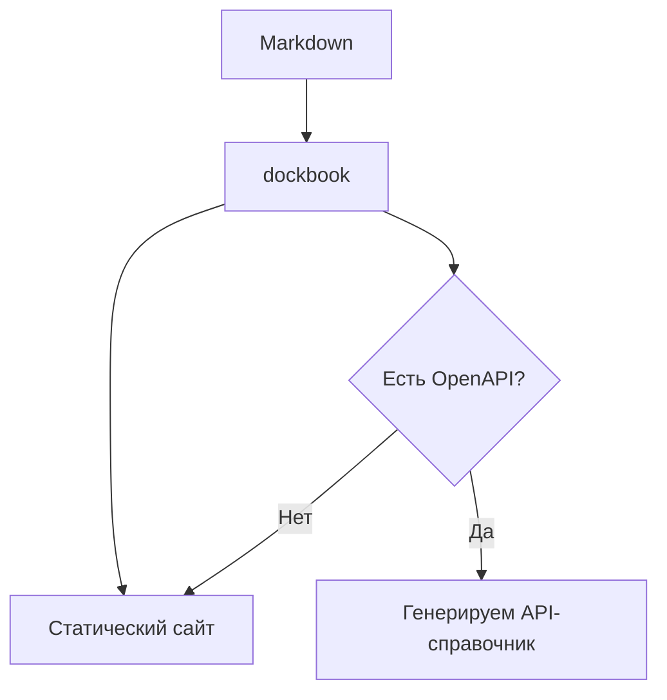
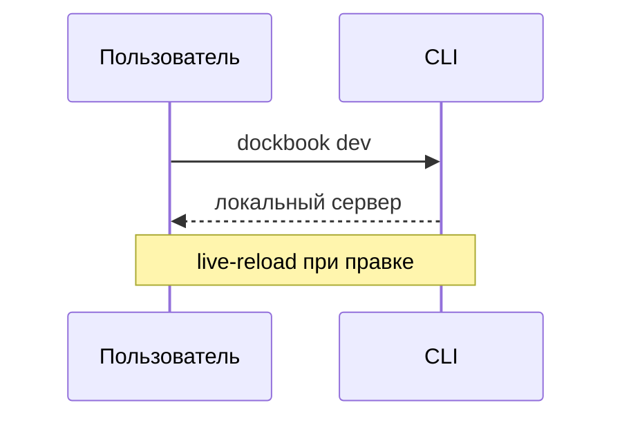
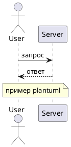

# Markdown-блоки

Помимо обычного markdown (заголовки, списки, таблицы, ссылки, код, цитаты)
dockbook понимает блочный синтаксис вида `::имя{атрибуты} ... ::` — то же,
что использует GitBook/Nuxt Content, только парсится собственным парсером
без внешних зависимостей.

## Hint

Подсказка с четырьмя вариантами оформления: `info`, `warning`, `danger`,
`success`.

```md
::hint{type="warning"}
Текст предупреждения.
::
```

::hint{type="warning"}
Текст предупреждения.
::

## Tabs

````md
::tabs
::tab{label="npm"}
```bash
npm install dockbook
```
::
::tab{label="pnpm"}
```bash
pnpm add dockbook
```
::
::
````

::tabs
::tab{label="npm"}
```bash
npm install dockbook
```
::
::tab{label="pnpm"}
```bash
pnpm add dockbook
```
::
::

## Steps

Каждый заголовок третьего уровня (`###`) внутри `::steps` становится
отдельным пронумерованным шагом.

```md
::steps
### Установка
Текст.

### Запуск
Текст.
::
```

::steps
### Установка
Текст.

### Запуск
Текст.
::

## Accordion

```md
::accordion
::accordion-item{label="Вопрос"}
Ответ.
::
::
```

::accordion
::accordion-item{label="Нужен ли Tailwind?"}
Нет — собственный CSS на custom properties.
::
::

## Cards

```md
::cards
::card{title="Заголовок" to="/route"}
Описание карточки.
::
::
```

::cards
::card{title="Установка" to="/guide/installation"}
dev / build / preview.
::
::card{title="Конфиг" to="/guide/configuration"}
Поля dockbook.config.js.
::
::

## Code Group

Как Tabs, но специально под блоки кода — подпись берётся из `[label]`
после языка.

````md
::code-group
```bash [npm]
npm install dockbook
```
```bash [pnpm]
pnpm add dockbook
```
::
````

::code-group
```bash [npm]
npm install dockbook
```
```bash [pnpm]
pnpm add dockbook
```
::

## Подсветка синтаксиса

Код в блоках подсвечивается прямо при сборке — свой токенайзер
(`src/highlight.js`), без сторонних библиотек. Достаточно указать язык
сразу после открывающих кавычек блока кода:

````md
```js
function greet(name) {
  return `Привет, ${name}!` // комментарий
}
```
````

```js
function greet(name) {
  return `Привет, ${name}!` // комментарий
}
```

Поддерживаются: `js`/`ts` (и алиасы `javascript`, `typescript`, `jsx`,
`tsx`), `python`/`py`, `bash`/`sh`/`shell`, `json`, `yaml`/`yml`,
`css`/`scss`/`less`, `html`/`xml`/`svg`. Неизвестный или отсутствующий язык
— код просто выводится без подсветки, без ошибок сборки.

::hint{type="info"}
Это не полноценный парсер грамматики языка, а быстрый токенайзер по
регуляркам — рассчитан на короткие примеры в документации, а не на
построчный линтинг реального проекта.
::

## Таблицы

Обычный GFM-синтаксис, поддерживается выравнивание колонок:

```md
| Колонка | Значение |
| --- | --- |
| A | 1 |
| B | 2 |
```

| Колонка | Значение |
| --- | --- |
| A | 1 |
| B | 2 |

## Диаграммы — Mermaid и PlantUML

Диаграммы рендерятся в SVG прямо при сборке, без единой библиотеки —
собственный парсер и layout-движок (`src/diagrams.js`). Можно писать как в
обычном fenced-блоке с языком `mermaid`/`plantuml`, так и через `::mermaid`/
`::plantuml`.

::hint{type="warning"}
Поддерживается осознанно ограниченное подмножество: у Mermaid — flowchart
(`graph`/`flowchart`) и `sequenceDiagram`, у PlantUML — только
sequence-диаграммы. Если код не распознан (например, `classDiagram`,
`gantt`, `pie`, activity-диаграммы PlantUML) — блок просто показывается как
обычный код, без ошибки сборки.
::

### Mermaid: flowchart

````md

````


Поддерживаются направления `TD`/`TB`/`BT`/`LR`/`RL`, формы узлов
`[прямоугольник]`, `(скруглённый)`, `{ромб}`, `((круг))`, стили связей
`-->` (сплошная), `-.->` (пунктир), `==>` (жирная) и подписи на связях
(`-->|текст|` или `-- текст -->`).

### Mermaid: sequenceDiagram

````md

````


### PlantUML: sequence-диаграмма

````md

````


## Инлайн-форматирование

Стандартно: `**жирный**`, `*курсив*`, `~~зачёркнутый~~`, `` `код` ``,
`[ссылка](/path)`, ``. Внешние ссылки (`http(s)://`)
автоматически получают `target="_blank" rel="noopener noreferrer"`.
